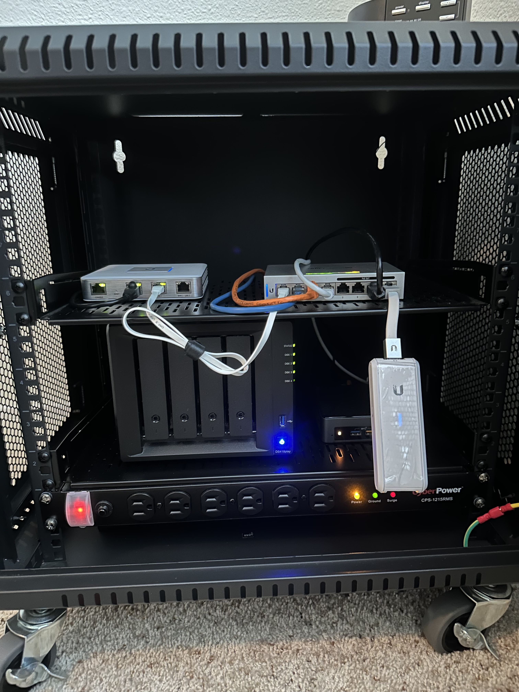

Compute:

- 1 Intel NUC
  - Dual-Core i3-8109U Up to 3.6GHz - 16GB DDR4 - 1 TB SSD
  - It's been running basically non-stop since 2019 with no issues
  - It runs all the services just fine
- 1 RapsberryPi 5

Storage:

- [Synology DS418play NAS Disk Station, 4-bay, 2GB DDR3L](https://www.amazon.com/gp/product/B075ZNKCK4/ref=ppx_yo_dt_b_search_asin_title?ie=UTF8&psc=1)
  - 3 x
    [Seagate IronWolf 4TB](https://www.amazon.com/gp/product/B07H289S79/ref=ppx_yo_dt_b_search_asin_title?ie=UTF8&psc=1)

Network. It’s all based on Mikrotik:

- Great hardware
- Great [software (router OS)](https://mikrotik.com/software)
- You learn a lot of networking using their products instead of Unifi

Cabinet:

- [V7 RMWC9UV450-1N](https://www.amazon.com/gp/product/B07NPG9TN9/ref=ppx_yo_dt_b_search_asin_title?ie=UTF8&psc=1)
- [CyberPower CPS1215RMS Surge Protector](https://www.amazon.com/gp/product/B00077INZU/ref=ppx_yo_dt_b_search_asin_title?ie=UTF8&psc=1)

## Notes

- I used Unifi for the longest time. Mikrotik is a bit harder to use but totally
  worth it
