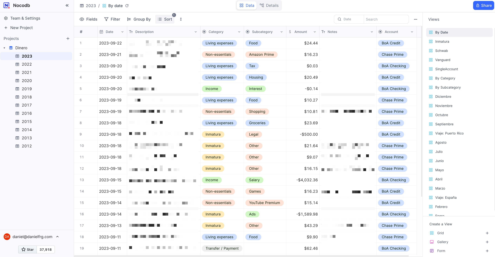
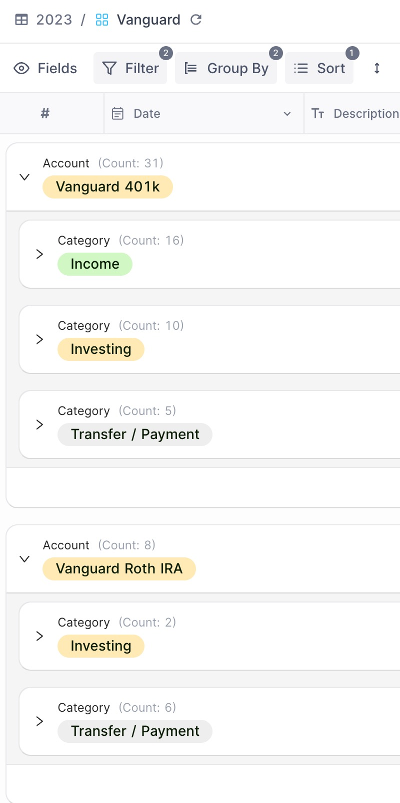
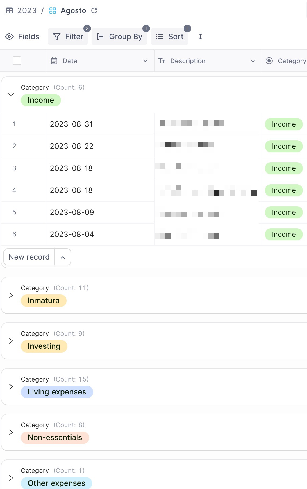

I have built my own personal finance system like Mint/YNAB. I call it `[dinero]`(https://github.com/danielfrg/dinero) (money in spanish). I use it to manage my personal and my small business finances.

It's a set of simple scripts that use [Plaid](https://plaid.com/) to get data from my banks Posgres to store the data and [NocoDB](https://nocodb.com/) to visualize it. I also use [Metabase](https://www.metabase.com/) to build some dashboards from the data and a couple of Jupyter Notebooks with extra analysis I run sporadically.

I have indexed all the data since 2012 (the year I moved to the US) and the data matches perfectly to my current bank statements in all my accounts.

- I did a backfill parsing PDFs in 2019 when I started using `dinero`

## Screenshots

Main view: All transactions of the year

View: A single account grouped by Category

View: Filter by one month and group by account:

## Categories

I created those myself based on my needs. `dinero` uses simple rules to match transactions and tag them accordingly, not much else is needed.

Categories are broad and general, I don't any. Subcategories are more open to be added.

- Income
    - Salary
    - 401k
    - Interest
- Living Expenses
    - Housing
    - Groceries
    - Food (going out)
    - Transportation
    - Phone
    - Internet
    - Electricity
    - Home (related purchases, reparation)
    - Health
    - Tax
- Other Expenses (non-recurrent things that are for my own good)
    - Services
    - Education
    - Software
    - Hardware
    - Hobbies
- Non-Essentials
    - Shopping (in general)
    - YouTube Premium
    - Netflix
    - Amazon Prime
    - Games
    - Entertainment (other)
    - Clothing
    - Gifts
    - Other (general social activities usually go here)

## Why NocoDB?

Most personal finance system use Google Sheets but I find a system like Airtable to be superior. Initially I used Airtable but since the pricing change it didn't really made sense for me to use it so I self-hosted NocoDB and it works just fine.

## Why now a service?

I used Mint for years. It was the closest thing to a service I liked. The web UI was terrible but thats fine. What's not fine is that Intuit had access to all my data.

I tries to use other services like YNAB which I find just way to complicated.

All I needed was to automate getting data from multiple banks accounts and credit cards into a simple format that I can use to group by some simple categories I defined manually and to easily get a picture of my spending.

## Alternatives?

This is not original, I initially got this idea from [yyx990803/build-your-own-mint](https://github.com/yyx990803/build-your-own-mint). I just wanted to make a couple of changes for my workflow and use Python instead of Node.JS. The same thing happened with [kevinschaich/mintable/](https://github.com/kevinschaich/mintable/) (which is great!).

Ddashboard tools like [paisa](https://paisa.fyi/) are very interesting but a bit to complex for my needs. I just need a quick overview to see I am not spending to much and peace of mind when I do my taxes.